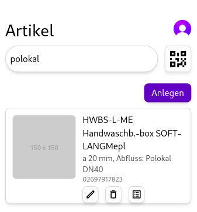

# Howareman
## Projektbeschreibung
"Howareman" ist eine Open-Source-App zur Verwaltung von Inventarbeständen. Sie ermöglicht es Nutzern, alle Arten von Artikeln effizient zu erfassen, zu speichern und zu verwalten. Funktionen wird später noch genauer eingegangen.

## Technologien

### Sveltekit
Dieses Projekt ist mit Sveltekit in der Version 4 erstellt. Für genauere Informationen zu Sveltekit, besuchen Sie bitte die [Sveltekit-Dokumentation](https://kit.svelte.dev/docs).

### TailwindCSS
TailwindCSS ist ein CSS-Framework, das auf Utility-First basiert. Es ermöglicht es, schnell und effizient CSS-Styles zu erstellen. Für genauere Informationen zu TailwindCSS, besuchen Sie bitte die [TailwindCSS-Dokumentation](https://tailwindcss.com/docs).

### MongoDB
MongoDB ist eine NoSQL-Datenbank, die auf Dokumenten basiert. Sie ermöglicht es, Daten in Form von JSON-ähnlichen Dokumenten zu speichern. Für genauere Informationen zu MongoDB, besuchen Sie bitte die [MongoDB-Dokumentation](https://docs.mongodb.com/).

## Resourcen
### Artikel
- _id
- articleNumber
- description
- ean
- name
- uuid
- warehouse
- category

### StockTaking
- _id
- uuid
- name
- articles

## Funktionen
### Artikel hinzufügen
Nutzer können Artikel hinzufügen, indem sie die Artikelnummer, die Beschreibung, die EAN, den Namen, die UUID, das Lager und die Kategorie eingeben.
