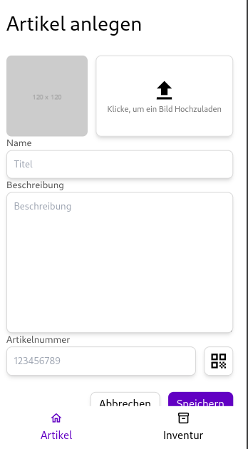
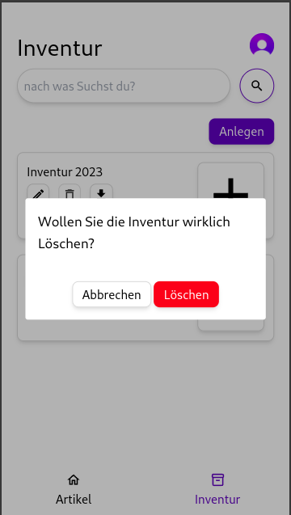
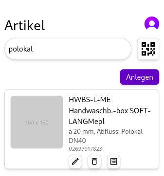
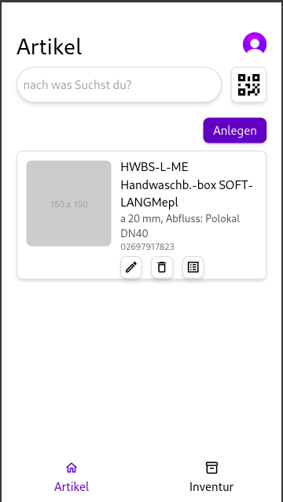
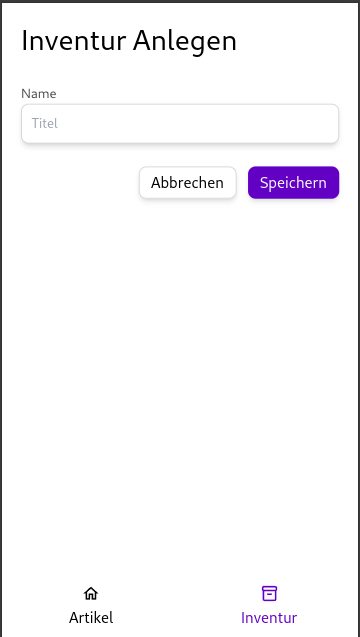
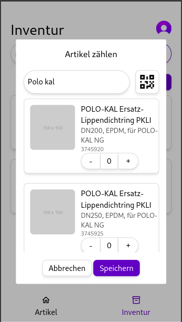

# Howareman
## Projektbeschreibung
"Howareman" ist eine Open-Source-App zur Verwaltung von Inventarbeständen. Sie ermöglicht es Nutzern, alle Arten von Artikeln effizient zu erfassen, zu speichern und zu verwalten. Auf weitere Funktionen wird später noch genauer eingegangen.

## Technologien


### Clerk
Die App verwendet eine Authentifizierung mithilfe von Clerk. Clerk ist ein Authentifizierungsdienst, der es ermöglicht, Nutzer zu verwalten und zu authentifizieren. Für genauere Informationen zu Clerk, besuchen Sie bitte die [Clerk-Dokumentation](https://docs.clerk.dev/).

### Sveltekit
Dieses Projekt ist mit Sveltekit in der Version 4 erstellt. Für genauere Informationen zu Sveltekit, besuchen Sie bitte die [Sveltekit-Dokumentation](https://kit.svelte.dev/docs).

### TailwindCSS
TailwindCSS ist ein CSS-Framework, das auf Utility-First basiert. Es ermöglicht es, schnell und effizient CSS-Styles zu erstellen. Für genauere Informationen zu TailwindCSS, besuchen Sie bitte die [TailwindCSS-Dokumentation](https://tailwindcss.com/docs).

### MongoDB
MongoDB ist eine NoSQL-Datenbank, die auf Dokumenten basiert. Sie ermöglicht es, Daten in Form von JSON-ähnlichen Dokumenten zu speichern. Für genauere Informationen zu MongoDB, besuchen Sie bitte die [MongoDB-Dokumentation](https://docs.mongodb.com/).

## Resourcen
### Artikel
- _id
- articleNumber
- description
- ean
- name
- uuid
- warehouse
- category

### StockTaking
- _id
- uuid
- name
- articles

## Funktionen
### Artikel hinzufügen



### Artikel löschen


### Artikel Suchen
Die Suche ermöglicht es, Artikel anhand von Artikelnummer, EAN, Name oder Beschreibung zu finden. Um eine Effiziente Fuzzy-Search zu ermöglichen habe ich die "Atlas Search" verwendet. Für genauere Informationen zur "Atlas Search", besuchen Sie bitte die [Atlas Search-Dokumentation](https://docs.atlas.mongodb.com/atlas-search/).




### Artikel Scannen
Die App ermöglicht es, Artikel mithilfe des Barcodes zu scannen. Wenn ein Artikel gescannt wurde wird automatisch nach dieser Artikelnummer gesucht und das Ergebnis angezeigt.



### Inventur Anlegen


### Inventur Löschen


### Artikel in Inventur hinzufügen
um Artikel in eine Inventur hinzuzufügen, könnnen diese wieder einfach gescannt, oder über die Suche gefunden werden. Im anschluss kann der Artikel mit der gezählten anzahl hinzugefügt werden.



### Inventur als CSV exportieren
Die App ermöglicht es, eine Inventur als CSV-Datei zu exportieren. Die CSV-Datei enthält die Spalten "Artikelnummer", "Name", "Beschreibung", "EAN", "Kategorie" und "Gezählte Anzahl".


## Installation
### Voraussetzungen
- Node.js
- pnpm
- MongoDB / Docker
- Clerk

### Schritte
#### 1. Repository klonen
```bash
git clone https://github.com/huemmerj/howareman
```

#### 2. Datenbank starten
Stellen Sie sicher, das Sie die MongoDB-Instanz gestartet haben. Wenn Sie Docker verwenden, können Sie die MongoDB-Instanz mit dem folgenden Befehl starten:

```bash
docker compose up
```

Fügen Sie die folgenden Umgebungsvariablen zur .env hinzu:

```env
MONGODB_URI
```

#### 3. Clerk konfigurieren
Erstellen Sie ein Clerk-Konto und konfigurieren Sie die Authentifizierung. Fügen Sie die folgenden Umgebungsvariablen zur .env hinzu:

```env
PUBLIC_CLERK_PUBLISHABLE_KEY
CLERK_SECRET_KEY
```

#### 4. Abhängigkeiten installieren
```bash
pnpm install
```

#### 5. App starten
```bash
pnpm dev
```


## Zukünftige Funktionen
- Bestelllisten
- Kategoriesuche
- Artikel bearbeiten
